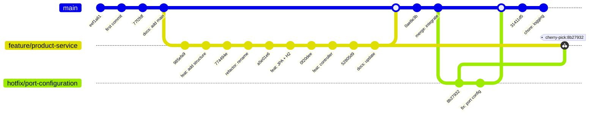

# 📚 Java Microservices - Product Management

Este repositorio contiene un taller práctico diseñado para enseñar conceptos avanzados de Git a través del desarrollo de dos microservicios utilizando Spring Boot. Los participantes aprenderán a manejar ramas, resolver conflictos, utilizar stash y cherry-pick, y más, mientras construyen una aplicación funcional.

## ✅ TODO

### Ejercicio 1: Configuración e Inicialización

- [x] ¿Se configuró correctamente el user.name y user.email en Git?
- [x] ¿Se inicializó el repositorio en la carpeta correcta?
- [x] ¿Se renombró la rama principal a main?
- [x] ¿Se verificó el estado con git status?

### Ejercicio 2: Primer Commit y .gitignore

- [x] ¿Se creó el archivo .gitignore con las reglas indicadas (target/, \*.log, .DS_Store, .idea/)?
- [x] ¿Se realizó el primer commit con el mensaje correcto?
- [x] ¿Se verificó el historial con git log --oneline?

### Ejercicio 3: Creación del Service B en nueva rama

- [x] ¿Se creó la rama feature/product-service correctamente?
- [x] ¿Se creó la estructura de carpetas y el archivo ProductManagementApplication.java?
- [x] ¿Se realizó el commit con el mensaje feat: add product service structure?

### Ejercicio 4: Desarrollo del ProductController

- [x] ¿Se creó ProductoController.java con los métodos GET y POST funcionales?
- [x] ¿Se agregó el archivo application.properties con la configuración correcta?
- [x] ¿Se realizó el commit con el mensaje feat: implement product controller with inventory management?

### Ejercicio 5: Merge y Resolución de Conflictos

- [x] ¿Se creó el conflicto en README.md en ambas ramas?
- [x] ¿Se intentó el merge y se resolvió el conflicto correctamente?
- [x] ¿El contenido final del README.md incluye ambas secciones y la lista de servicios?
- [x] ¿Se realizó el commit con el mensaje merge: integrate product service with conflict resolution?

### Ejercicio 6: Mejoras y Stash

- [x] ¿Se modificó `BookController` para agregar logging?
- [x] ¿Se guardaron los cambios con git stash push y mensaje descriptivo?
- [x] ¿Se creó la rama hotfix/port-configuration y se corrigió la configuración?
- [x] ¿Se realizó el commit con el mensaje fix: remove database config causing startup issues?

### Ejercicio 7: Aplicar Stash y Cherry-pick

- [x] ¿Se hizo merge del hotfix a main?
- [x] ¿Se aplicó el stash y se realizó el commit con el mensaje feat: add input validation to user creation?
- [x] ¿Se realizó el cherry-pick del hotfix en la rama feature/product-service?

### Ejercicio 8: Testing y Push

- [x] ¿Se ejecutó el servicio con `gradle bootRun`?
- [x] ¿Se probaron los endpoints con curl para crear y listar usuarios/productos?
- [x] ¿Se verificó el historial con git log --oneline --graph --all?
- [x] ¿Se listaron las ramas con git branch -a?

## 🛠️ Pruebas

### Obtener todos los libros

```powershell
curl -X GET http://localhost:8081/api/v1/books `
  -H "Content-Type: application/json"
```

**Respuesta:**

```json
[
  {
    "id": 1,
    "title": "El Quijote",
    "author": "Miguel de Cervantes",
    "isbn": "978-84-376-0494-1",
    "publishedYear": 1605
  },
  {
    "id": 2,
    "title": "Cien años de soledad",
    "author": "Gabriel Garcí­a Márquez",
    "isbn": "978-84-376-0494-2",
    "publishedYear": 1967
  },
  {
    "id": 3,
    "title": "1984",
    "author": "George Orwell",
    "isbn": "978-84-376-0494-3",
    "publishedYear": 1949
  },
  {
    "id": 4,
    "title": "Por quién doblan las campanas",
    "author": "Ernest Hemingway",
    "isbn": "9788491050151",
    "publishedYear": 1940
  }
]
```

### Crear un nuevo libro

```powershell
curl -X POST http://localhost:8081/api/v1/books `
  -H "Content-Type: application/json" `
  -d '{
    "title": "Por quién doblan las campanas",
    "author": "Ernest Hemingway",
    "isbn": "9788491050151",
    "publishedYear": 1940
  }'
```

**Respuesta:**

```json
{
  "id": 4,
  "title": "Por quién doblan las campanas",
  "author": "Ernest Hemingway",
  "isbn": "9788491050151",
  "publishedYear": 1940
}
```

### Graph



### Branches

```plaintext
* feature/product-service
  hotfix/port-configuration
  main
  remotes/origin/HEAD -> origin/main
  remotes/origin/feature/product-service
  remotes/origin/main
```

## Author

- David Reyes
